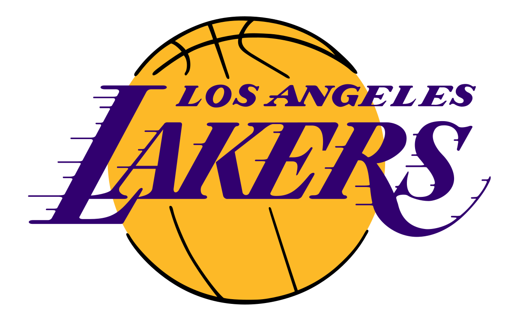

# Investigating the Impact of Historical Success and Market Appeal on the Team Valuation of the Los Angeles Lakers

## Overview

This project investigates how historical success and market appeal have influenced the valuation of the Los Angeles Lakers, one of the most iconic NBA franchises. Using regression analysis and econometric models, the study evaluates key factors such as winning percentage, fan cost index (FCI), and superstar influence to uncover the drivers behind team valuations in professional sports.

### 1. The Legacy and Valuation of the Los Angeles Lakers

17 championships, a team currently worth $7.1 Billion in value, and a legacy of countless iconic players – The Los Angeles Lakers are undisputedly recognized as one of the most storied franchises in National Basketball Association (NBA) history. Before the Lakers came the Detroit Gems, founded in 1946. They moved to Minneapolis, Minnesota the subsequent year, then finally to Los Angeles ahead of the 1906-61 season after a spell of financial and performance troubles, where they have remained as a member of the Pacific Division of the Western Conference ever since (Augustyn). Over its 77 season history, the Lakers’ has housed some of the NBA’s greatest legends, including Magic Johnson, Kareem Abdul-Jabbar, and Kobe Byrant to name a few. Such stars brought about many eras of triumph, establishing the west coast team not only as a dominant force on the court, but also as a distinguished international brand loved by fans around the globe.
The Lakers' consistent success and "Hollywood" appeal contribute to their substantial year-on-year valuation growth. Situated in Los Angeles, with its affluent population and status as the entertainment capital, the team regularly draws celebrities and high-net-worth individuals to the Crypto.com Arena. This allows them to charge premium ticket prices, secure lucrative sponsorships, and maintain a significant impact on basketball culture (Ozzy's Collectible Hub). Although the Buss family – owners of the Lakers – may not boast the greatest financial resources, the purple-and-yellow outfit’s brand alone grants them a truly unique position in the industry; one that very few teams can rival, particularly in terms of commercial partnerships and merchandise sales (Pincus).

2018 marked a pivotal moment for the Lakers as they signed 4-time MVP winner LeBron James to a 4-Year $154 Million Deal in a bid to end one of the most unsuccessful periods in their history (Stein and Cacciola). Since the 4-time champion’s arrival, the Lakers have reported intense ticket demand. James Peltz of the L.A. Times reported that “The lowest price of a Lakers season ticket for Staples Center [now Crypto.com Arena] games jumped to $5,750 from $3,499 on StubHub.com, while the high end reached nearly $100,000”. James’ influence also extends to merchandise sales; Jack Boyle, co-president of the direct-to-consumer business at Fanatics, disclosed that LeBron’s Lakers jersey set a new single-day record in dollar sales for an NBA player joining a new team as a free agent or by a trade (Peltz). Even though COVID-19 caused operating income and revenue to stagnate between 2020-2021, the Lakers’ valuation has always remained on an upwards trajectory, as seen in Figure 1 below. A report published by Forbes recorded a positive 11% value change between 2023 and 2024, as substantiated by revenues totalling $552 million and an operating income of $199 million (Teitelbaum and Knight). It’s no surprise to see the Lakers being ranked among the highest-valued NBA franchises, thanks to its robust combination of revenue sources. But with the game’s biggest star on board, the Lakers have taken their marketability to another level, creating a financial profile that is profitable and positioned for sustained growth. Having re-signed once in 2022 and again in 2024, only time will tell what more James and the Lakers can achieve. 

Figure 1. The Los Angeles Lakers’ market value from 2016 to 2021

### 2. An Analysis of the League

As one of the “Big Four”, the NBA is supported by a myriad of revenue streams that benefits its 30 franchises. A greater proportion of revenue generated by the NBA and its subsidiaries are classified as basketball-related income (BRI), which includes gate receipts, broadcasting deals, sponsorships, and merchandise sales; the final figure is used as a factor in calculating the salary cap. Meanwhile, funds directed towards expansion teams, fines, and revenue sharing fall under non-BRI (Nath and Brown). Moreover, winning should allow teams to charge higher ticket prices and promote a proliferation in merchandise demand, thus positively contributing to the financial health and image of both team and league.

In this study, we wish to investigate how the Lakers’ history of success and the surge in market appeal contributed to the team’s increase in valuation. Many elements contribute to the valuation of a team and a league, and we have approached this study from both the perspective of the team as well as the fans – arguably the two most important stakeholders in sports. Focus is directed towards exploring the effects brought about by superstars, specifically in the form of LeBron James during his tenure as a Laker from 2018 to 2021. Paramount to team valuation, our dependent variable, are a team’s winning percentage and their corresponding Fan Cost Index (FCI) value. A team’s winning percentage is a broad indicator for performance, and is an aspect that ties with entertainment value and brand image. From a fan standpoint, FCI represents the cost of a family attending a NBA game, accounting for ticket price, concessions, parking, and merchandise. We have chosen the value of the team as our independent variable because it reflects the holistic financial impact of both on-court success and off-court factors such as branding, fan engagement, and revenue generation. The regression analysis was conducted on revenue over a 9-year period from 2012 to 2021, with averages used to fill in missing values for winning percentages and the Fan Cost Index. To ensure consistency across data, all monetary values have been adjusted for inflation to real 2020 dollars. 

Our regression analysis did not find a statistically significant correlation between winning percentage and team value. In fact, we obtained a negative correlation between winning and valuation, perhaps hinting that other factors such as brand or location would play a much greater role in determining a team’s worth in dollars. Across the league, simply winning more did not necessarily contribute to raising a team’s valuation, which is rather unexpected. At a rudimentary level, we presumed that winning more to make the playoffs would allow the team to qualify for pecuniary bonuses, but it seems that the prize money is by all accounts negligible. Instead, making the playoffs allow teams to elevate ticket prices, sell more merchandise, and boost their viewership, which leads us to our other independent variable. 

Our analysis has indicated that a dollar increase in the FCI is associated with an average increase in team value by about $4.97 million across the NBA, significant to a p-value of 0.001. An r-squared value of 0.3965 means that approximately 39.65% of the variance in team value is explained by FCI, or in other words, a moderate positive correlation. Understandably, having more fans turn up and charging premiums for game-day activities would render superior incomes for the team. The Lakers’ also command the ability to charge premium pricing due to their storied success and superstar appeal with the likes of LeBron James on the team, whose impact also compounds onto their market valuation.

As one of the “Big Four”, the NBA is supported by a myriad of revenue streams that benefits its 30 franchises. A greater proportion of revenue generated by the NBA and its subsidiaries are classified as basketball-related income (BRI), which includes gate receipts, broadcasting deals, sponsorships, and merchandise sales; the final figure is used as a factor in calculating the salary cap. Meanwhile, funds directed towards expansion teams, fines, and revenue sharing fall under non-BRI (Nath and Brown). Moreover, winning should allow teams to charge higher ticket prices and promote a proliferation in merchandise demand, thus positively contributing to the financial health and image of both team and league.

In this study, we wish to investigate how the Lakers’ history of success and the surge in market appeal contributed to the team’s increase in valuation. Many elements contribute to the valuation of a team and a league, and we have approached this study from both the perspective of the team as well as the fans – arguably the two most important stakeholders in sports. Focus is directed towards exploring the effects brought about by superstars, specifically in the form of LeBron James during his tenure as a Laker from 2018 to 2021. Paramount to team valuation, our dependent variable, are a team’s winning percentage and their corresponding Fan Cost Index (FCI) value. A team’s winning percentage is a broad indicator for performance, and is an aspect that ties with entertainment value and brand image. From a fan standpoint, FCI represents the cost of a family attending a NBA game, accounting for ticket price, concessions, parking, and merchandise. We have chosen the value of the team as our independent variable because it reflects the holistic financial impact of both on-court success and off-court factors such as branding, fan engagement, and revenue generation. The regression analysis was conducted on revenue over a 9-year period from 2012 to 2021, with averages used to fill in missing values for winning percentages and the Fan Cost Index. To ensure consistency across data, all monetary values have been adjusted for inflation to real 2020 dollars. 

Our regression analysis did not find a statistically significant correlation between winning percentage and team value. In fact, we obtained a negative correlation between winning and valuation, perhaps hinting that other factors such as brand or location would play a much greater role in determining a team’s worth in dollars. Across the league, simply winning more did not necessarily contribute to raising a team’s valuation, which is rather unexpected. At a rudimentary level, we presumed that winning more to make the playoffs would allow the team to qualify for pecuniary bonuses, but it seems that the prize money is by all accounts negligible. Instead, making the playoffs allow teams to elevate ticket prices, sell more merchandise, and boost their viewership, which leads us to our other independent variable. 

Our analysis has indicated that a dollar increase in the FCI is associated with an average increase in team value by about $4.97 million across the NBA, significant to a p-value of 0.001. An r-squared value of 0.3965 means that approximately 39.65% of the variance in team value is explained by FCI, or in other words, a moderate positive correlation. Understandably, having more fans turn up and charging premiums for game-day activities would render superior incomes for the team. The Lakers’ also command the ability to charge premium pricing due to their storied success and superstar appeal with the likes of LeBron James on the team, whose impact also compounds onto their market valuation.

### 3. The Lakers in the Context of the League

Like any other premier sports franchise, the Los Angeles Lakers’ financial circumstances are materially dictated by factors that are both league-driven and contingent on the team’s performance and commercial attraction. In cultivating the Lakers’ identity, Original owner Dr. Jerry Buss pioneered the concept of “Showtime”, fusing together basketball and entertainment, which bestowed the Lakers with a Hollywood semblance that has flourished on-and-off court (Lakers Nation). 

We expect winningest teams to be rewarded with higher attendance and fan engagement, which is crucial to generating revenue, especially for a large market global team like the Lakers. Consequently, better teams also gain more media coverage and sponsorships, as brands seek to associate themselves with winning teams that have greater exposure. In our analysis, we observed that a one-percent increase in winning percentage correlated with roughly $64.33 million increase in team value. However, a p-value of 0.115 denotes the relationship to be insignificant, which is consistent with the regression conducted on the entire league. Evidently, there are other factors that exert more influence on team valuation than winning percentage, even at a team level. 

The Lakers surpassed the league average by a striking degree in terms of FCI, where a per dollar increase is associated with almost $34.08 million gain in team value. Again, this result is highly statistically significant, and is far greater than the league average of 4.7 million. In line with our expectations, such a discrepancy demonstrates the Lakers' unparalleled market position. Despite the Lakers’ high FCI, it seems to have minimal deterrence on attendance, which may imply a high perceived value due to their appeal and market location of Los Angeles, and this is one big reason that makes them one of the most valuable teams in the league.

Looking ahead, the Lakers’ should feel relatively positive about their short-term financial picture. Despite the trouble brought about by COVID-19, the team still recorded positive numbers, and have been on a clear uptrend since restrictions have been lifted. With a squad mixed with young prospects like Austin Reaves and Rui Hachimura, and combining them with experienced veterans like Anthony David and of course, LeBron James, prospects of winning another championship should not falter. In spite of the fact that there is no clear correlation between winning and team valuation, the LA side must maintain their ambition to win every year, as making the playoffs and performing well enable the team to earn remarkably steeper revenues when compared to the regular season, and is sure to bring positive impression on new and old fans alike. If the Lakers’ can maintain a regularity of winning and continue to maximise their worldwide interest, growth and financial stability is only a matter of time and extent.
