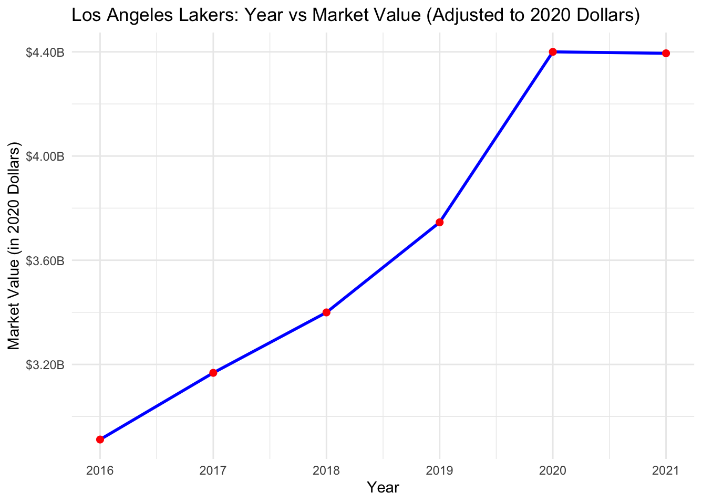

# Investigating the Impact of Historical Success and Market Appeal on the Team Valuation of the Los Angeles Lakers

## Overview

This project investigates how historical success and market appeal have influenced the valuation of the Los Angeles Lakers, one of the most iconic NBA franchises. Using regression analysis and econometric models, the study evaluates key factors such as winning percentage, fan cost index (FCI), and superstar influence to uncover the drivers behind team valuations in professional sports.

### 1. The Legacy and Valuation of the Los Angeles Lakers

17 championships, a team currently worth $7.1 Billion in value, and a legacy of countless iconic players – The Los Angeles Lakers are undisputedly recognized as one of the most storied franchises in National Basketball Association (NBA) history. Before the Lakers came the Detroit Gems, founded in 1946. They moved to Minneapolis, Minnesota the subsequent year, then finally to Los Angeles ahead of the 1906-61 season after a spell of financial and performance troubles, where they have remained as a member of the Pacific Division of the Western Conference ever since (Augustyn). Over its 77 season history, the Lakers’ has housed some of the NBA’s greatest legends, including Magic Johnson, Kareem Abdul-Jabbar, and Kobe Byrant to name a few. Such stars brought about many eras of triumph, establishing the west coast team not only as a dominant force on the court, but also as a distinguished international brand loved by fans around the globe.
The Lakers' consistent success and "Hollywood" appeal contribute to their substantial year-on-year valuation growth. Situated in Los Angeles, with its affluent population and status as the entertainment capital, the team regularly draws celebrities and high-net-worth individuals to the Crypto.com Arena. This allows them to charge premium ticket prices, secure lucrative sponsorships, and maintain a significant impact on basketball culture (Ozzy's Collectible Hub). Although the Buss family – owners of the Lakers – may not boast the greatest financial resources, the purple-and-yellow outfit’s brand alone grants them a truly unique position in the industry; one that very few teams can rival, particularly in terms of commercial partnerships and merchandise sales (Pincus).

2018 marked a pivotal moment for the Lakers as they signed 4-time MVP winner LeBron James to a 4-Year $154 Million Deal in a bid to end one of the most unsuccessful periods in their history (Stein and Cacciola). Since the 4-time champion’s arrival, the Lakers have reported intense ticket demand. James Peltz of the L.A. Times reported that “The lowest price of a Lakers season ticket for Staples Center [now Crypto.com Arena] games jumped to $5,750 from $3,499 on StubHub.com, while the high end reached nearly $100,000”. James’ influence also extends to merchandise sales; Jack Boyle, co-president of the direct-to-consumer business at Fanatics, disclosed that LeBron’s Lakers jersey set a new single-day record in dollar sales for an NBA player joining a new team as a free agent or by a trade (Peltz). Even though COVID-19 caused operating income and revenue to stagnate between 2020-2021, the Lakers’ valuation has always remained on an upwards trajectory, as seen in Figure 1 below. A report published by Forbes recorded a positive 11% value change between 2023 and 2024, as substantiated by revenues totalling $552 million and an operating income of $199 million (Teitelbaum and Knight). It’s no surprise to see the Lakers being ranked among the highest-valued NBA franchises, thanks to its robust combination of revenue sources. But with the game’s biggest star on board, the Lakers have taken their marketability to another level, creating a financial profile that is profitable and positioned for sustained growth. Having re-signed once in 2022 and again in 2024, only time will tell what more James and the Lakers can achieve. 

Figure 1. The Los Angeles Lakers’ market value from 2016 to 2021

### 2. An Analysis of the League

The NBA, as one of the "Big Four" sports leagues, benefits from diverse revenue streams, including gate receipts, broadcasting deals, sponsorships, and merchandise sales. This study explores the Lakers’ success and appeal, focusing on:

- **Winning Percentage**: A measure of team performance.
- **Fan Cost Index (FCI)**: Accounts for the cost of attending a game, including tickets, concessions, parking, and merchandise.

**Regression Analysis Results:**
- No significant correlation between winning percentage and team valuation.
- A positive correlation between FCI and team valuation, with a $1 increase in FCI associated with a $4.97 million increase in team value.

---

### 3. The Lakers in the Context of the League

As a premier sports franchise, the Lakers’ financial standing is shaped by league dynamics and their unique market position.

**Key Findings:**
- A $34.08 million valuation increase per $1 increase in FCI, far surpassing the league average.
- No clear correlation between winning percentage and team valuation, emphasizing the importance of branding and marketability.

Looking ahead, the Lakers' blend of experienced stars like LeBron James and promising talent positions them for sustained growth and success.

---

## Data and Analysis

- **Timeframe:** 2012–2021
- **Variables:** Winning percentage, FCI, team valuation
- **Methodology:** Regression analysis using inflation-adjusted monetary values.

*Insert image: Relevant graphs and regression tables.*

---

## Conclusion

This study highlights the complex factors influencing the valuation of professional sports teams. For the Lakers, branding, market appeal, and fan engagement outweigh on-court performance in determining their financial success.

---

## References

- Augustyn, Adam. *Los Angeles Lakers.* Encyclopædia Britannica.
- Nath, Trevir I. *The NBA’s Business Model.* Investopedia.
- Peltz, James F. *Lakers Look to King James’ Golden Marketing Touch.* Los Angeles Times.

*For a full list of references, see the original document.*
